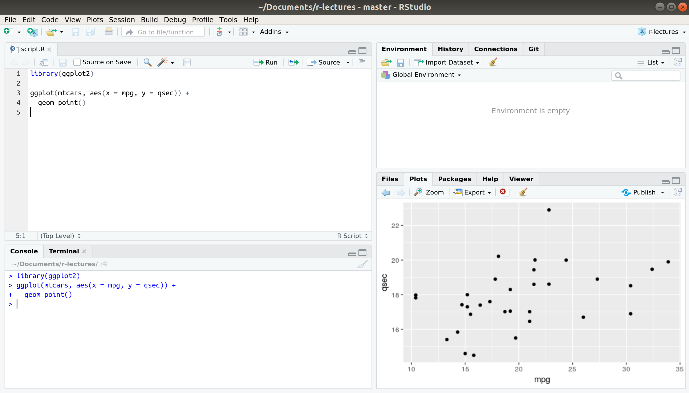

```{r setup, include=FALSE}
knitr::opts_chunk$set(echo = TRUE)
library(ggplot2)
```

## Agenda

> - Introduction: Data visualisation with `mtcars`
> - Basic rules of programming with R
> - Workflow
> - What is this course about?

# Introduction

## Visualise data with `ggplot2`

> - `ggplot2` is a package
>     + a *package* consists of functions and other objects which deal with a specific task
>     + the task of `ggplot2` is data visualisation
> - it implements the grammar of graphics

## Visualise data with `ggplot2`

- `ggplot2` is a package
    + a *package* consists of functions and other objects which deal with a specific task
    + the task of `ggplot2` is data visualisation
- it implements the grammar of graphics

```{r eval = FALSE}
install.packages("ggplot2")
library(ggplot2)
```

## Example dataset: `mtcars`

> - data from the 1974 *Motor Trend* US magazine
> - variables include:
>     + `mpg` Miles/(US) gallon
>     + `qsec` 1/4 mile time
>     + `vs` V engine or straight engine?

## Grammar of graphics

- the basis of the visualisation is the **data**
- every variable is mapped to an aesthetic **mapping** (e. g. `x`, `y`, `color`)

```{r eval = FALSE}
aes(x = mpg, y = qsec)
```

- a **layer** uses the aesthetic information to build elements of a plot

## Example

Are cars with higher fuel consumption faster?

```{r}
ggplot(data = mtcars, mapping = aes(x = mpg, y = qsec)) + 
  geom_point()
```

## Exercise 1: data visualisation

1. Leave out data, mapping and layer in the code above. What happens?
2. Map `vs` to the aesthetic `color`. How does the plot change and why?
3. Look up the different variables of `mtcars` by calling `?mtcars`. Choose two variables which are interesting to you and build their scatterplot.
4. Look up `?geom_bar` and try to build a bar plot answering the question "How is the number of cylinders distributed across the cars?"

# Basic rules of programming with R

## Variables

- Variables store values
- Variables are assigned by  `<-`:

```{r}
x <- 5
x
```

## Calculations

```{r}
5 + 5 
5 * 2
5 + 2 * (5 / 4)
```

## Functions

```{r}
log(x = 2)
```

## Functions

```{r}
log(x = 2)
```

```{r}
?log
```

## Functions: default arguments

> - Default arguments:
>     + allow you to change standard values
>     + but only when you need to
> - Example: `base` argument of `log`
>     + Default value: $e$
>     + what if you want to compute $log_2(10)$?
    
## Functions: default arguments

- Default arguments:
    + allow you to change standard values
    + but only when you need to
- Example: `base` argument of `log`
    + Default value: $e$
    + what if you want to compute $log_2(10)$?
    
```{r}
log(x = 10, base = 2)
```

## Exercise 2

Why do you think that the following code does not work?

```{r error = TRUE}
2 <- 2
```

What is the value of x?

```{r}
x <- 2
x <- 2 * x
```

Look up possible arguments to `geom_point` by calling `?geom_point` and try to make the points in our scatterplot red.

# Workflow

## RStudio environment and scripts

```{r echo = FALSE, out.height = "400px"}

```

## Exercise 3

Create an R script which executes the following lines of code:

```{r}
ggplot(mtcars, aes(x = mpg, y = qsec)) + 
  geom_point()
```

## Reproducibility

> - It is important for other people to understand your analysis
> - Understanding your analysis almost always includes reproducing (parts of) it
> - You want to make sure you can always recreate your analysis, e. g. with new > values
> - You need *scripts* to reproduce your *objects*
> - RStudio *projects* are a nice way of gathering scripts with a related purpose

## Getting help

> * R documentation: `?<object>` or `??<general_term>`
> * StackOverflow
> * Error message? Copy and google it.
> * Learning resources
> * Most importantly: frustration is a normal part of the process.

## Exercise 4

Find out how to build a histogram with `ggplot2`.

# What is this course about?

## Goals

I want to

> - teach you the basics of R
> - give you an overview over the capabilities of R
> - help you learn about the topics you are interested in

## Resources

> - "R for Data Science" by Garrett Grolemund and Hadley Wickham (r4ds.had.co.nz)
>     + many lectures will be based on this book
>     + I will refer you to the appropriate chapters
> - DataCamp (datacamp.com)

## The following lectures

> - `for` and `while` loops, `if`/`else` conditionals and creating your own functions
> - data transformation
> - reading in data
> - creating reports and books with R

## Further reading

- R4DS, ch. 2-4, 6, 8
- `ggplot2`: https://ggplot2.tidyverse.org/
- [Introduction to the grammar of graphics](http://vita.had.co.nz/papers/layered-grammar.pdf)
- these slides can be found on github.com/sflippl/r-lectures