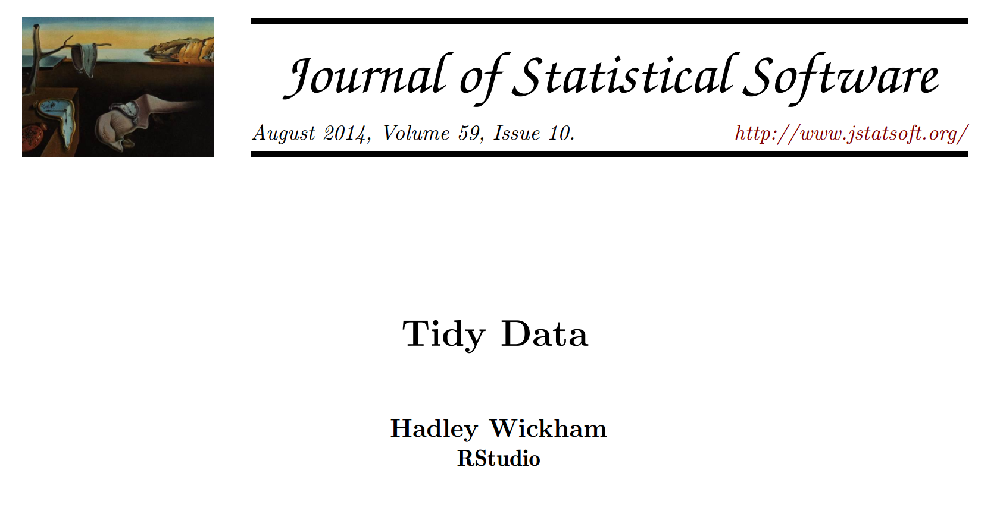
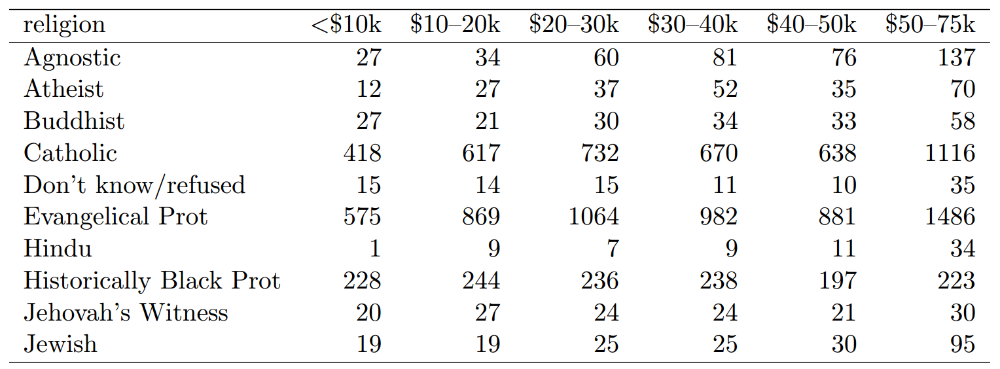
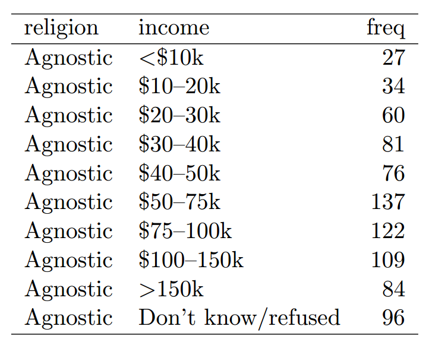

<script src="https://ajax.googleapis.com/ajax/libs/jquery/1.12.2/jquery.min.js"></script>

<script>
    $(document).ready(function() {
    $('slide:not(.title-slide, .backdrop, .segue)').append('<footer></footer>');    
    $('footer').attr('label', 'Slides are available at https://github.com/sflippl/r-lectures');

  })
</script>

<style>
  footer:after {
    font-size: 12pt;
    content: attr(label);
    position: absolute;
    margin-left: auto;
    margin-right: auto;
    left: 0;
    right: 0;
    text-align:center;
    bottom: 20px;
    line-height: 1.9;
    display: block;
  }
</style>

```{r setup, include=FALSE}
knitr::opts_chunk$set(echo = TRUE)
library(tidyverse)
library(DT)
```

## Agenda

> - Tibbles and data frames
> - Tidy data
> - The tidyverse
> - Data transformation

# Tibbles and data frames

## First look

```{r eval = FALSE}
library(dplyr)
starwars
```

## First look

```{r}
library(dplyr)
starwars
```

## First look

```{r}
library(dplyr)
as.data.frame(starwars)
```

## Tibbles

```{r eval = FALSE}
vignette("tibble")
```

Tibbles are a modern take on data frames. They keep the features that have stood the test of time, and drop the features that used to be convenient but are now frustrating.

> - You should always use tibbles

## Data frames

Data frames consist of:

> - rows representing observations
> - columns representing variables
> - every column has one type

## Column types

> - Numbers:
>     + `dbl`: real numbers
>     + `int`: integers
> - `lgl`: boolean (true/false)
> - `chr`: Characters
> - `fct`: Factors
> - many other types

## Factors

- represent categorical variables

```{r}
colleges <- c("St Edmund", "Exeter", "Queen's", "St John's")
x <- c("St Edmund", "Exeter", "St Edmund", "Queen's", 
       "St Edmund", "Queen's", "Exeter", "Exeter")
fct <- factor(x, levels = colleges)
fct
str(fct)
```

## Structure of factors

```{r}
attributes(fct)
levels(fct)
```

## Exercise 1

1. Create a tibble with three rows (different students) and the two variables `name` (as a character) and `college` (as a character). (If someone does not have a college, type in "NA" (not applicable).)
2. Turn the character column into a factor.
3. Dangers with factors: what is happening in the following two lines of code?

```{r}
as.integer(c("1", "2"))
as.integer(factor(c("2", "1")))
```

# Tidy data

## Tidy data

http://www.jstatsoft.org/v59/i10/paper

```{r echo = FALSE, out.width = "100%"}

```

## Tolstoy in statistics

"Happy families are all alike; every unhappy family is unhappy in its own way." - Leo Tolstoy

"Tidy datasets are alike but every messy dataset is messy in its own way." - Hadley Wickham

> - A standardized format for datasets makes their manipulation easier.

> 1. Each variable forms a column.
> 2. Each observation forms a row. 
> 3. Each type of observational unit forms a table.

## Messy data: example

```{r echo = FALSE, out.width = "100%"}

```

> - Problem: Variable headers are values

## Messy data: solution

```{r echo = FALSE, out.width = "70%"}

```

## Remarks on tidy data

> - the principles of tidy data might seem trivial but they are not
> - functions expect tidy input and give tidy output (exceptions are e. g. visualizations)

# The tidyverse

## The tidyverse

- the tidyverse implements a tidy approach towards data analysis

```{r eval = FALSE}
install.packages("tidyverse")
library(tidyverse)
```

## Coding style

- a variable is an object
- a function is a verb
- the pipe `%>%` connects objects and verbs

```{r eval = FALSE}
diamonds %>% 
  filter(cut == "Ideal") %>% 
  select(carat, clarity)
```

## Coding style

```{r echo = FALSE}
diamonds %>% 
  filter(cut == "Ideal") %>% 
  select(carat, clarity)
```

## The pipe

```{r eval = FALSE}
diamonds %>% 
  filter(cut == "Ideal")
```

is actually

```{r eval = FALSE}
filter(diamonds, cut == "Ideal")
```

## The pipe

```{r eval = FALSE}
diamonds %>% 
  filter(cut == "Ideal") %>% 
  select(carat, clarity)
```

is actually

```{r eval = FALSE}
select(
  filter(diamonds, cut == "Ideal"), 
  carat, clarity
)
```

## The pipe makes code more readable

```{r}
diamonds %>% 
  filter(cut == "Ideal") %>% 
  group_by(color) %>% 
  summarise(price = mean(price)) %>%
  ggplot(aes(x = color, y = price)) + 
  geom_bar(stat = "identity")
```

## Exercise 2

Split the following chunks of code up using the pipe:

```{r eval = FALSE}
select(
  diamonds, 
  color, cut, clarity
)
```

```{r eval = FALSE}
filter(
  select(
    diamonds,
    color, cut, clarity, depth
  ), 
  depth >= 60
)
```

# Data transformation

## Select variables

- `select` selects all given, unquoted variables
- there are special functions to help with selection

```{r}
diamonds
```

## `select`: drop variables

```{r}
diamonds %>% 
  select(-x, -y, -z)
```

## `select`: `:` picks adjacent variables

```{r}
diamonds %>% 
  select(carat:price)
```

## `select`: special functions

- see manual

```{r}
diamonds %>% 
  select(carat, ends_with("e"))
```

## Exercises: Preliminary remarks

For our exercises, we will look at the `nycflights13` dataset:

```{r eval = FALSE}
install.packages("nycflights13")
library(nycflights13)
```

The `dplyr` cheatsheet might be helpful: https://www.rstudio.org/links/data_transformation_cheat_sheet

## Exercise 3

Solve the exercises in: https://r4ds.had.co.nz/transform.html#exercises-9

## Filter the data frame

- use logical criteria to filter rows
- you can use the data frame's variables

```{r eval = FALSE}
diamonds %>% 
  filter(cut == "Ideal")
```

```{r eval = FALSE}
diamonds %>% 
  filter(cut == "Ideal", depth >= 60)
```

## Logical operators

- Compare values:
    - `x == y`: Are x and y equal?
    - `x != y`: Are x and y not equal?
- Modify logical values:
    - `!x`: not x
    - `x | y`: x or y
    - `x & y`: x and y
    
## Exercise 4

Solve exercises 1 and 2 in: https://r4ds.had.co.nz/transform.html#exercises-7

## Mutate the data frame

- `mutate` adds new variables
- you can use the values of other variables within the variables
- uses *vectorized functions*

```{r eval = FALSE}
diamonds %>% 
  mutate(price_per_carat = price / carat)
```

## Vectorized functions

- Vectorized functions return one value for each entry
    + examples: `x + y`, `log(x)`, `==`

## Exercise 5

Solve exercises 2 and 3 in: https://r4ds.had.co.nz/transform.html#exercises-10

## Group the data frame

```{r}
diamonds %>% 
  group_by(cut)
```

## Summarise the groups

```{r}
diamonds %>% 
  group_by(color) %>% 
  summarise(mean_price = mean(price))
```

## Exercise 6

1. Determine the mean price for each cut
2. Determine the number of occurrences for each cut (hint: look at `n()`)
3. Determine the maximal price and the maximal carat for each color
4. Determine the mean price for each combination of cut and color

## Further reading

- R4DS, ch. 5, 9, 10, 12
- "Tidy data" by Hadley Wickham: http://www.jstatsoft.org/v59/i10/paper
- Introduction to the tidyverse: tidyverse.org
- `dplyr` cheatsheet: https://www.rstudio.org/links/data_transformation_cheat_sheet