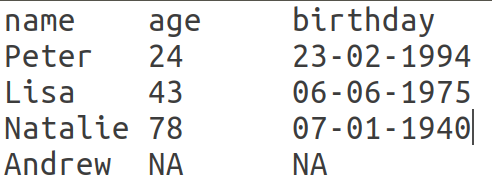
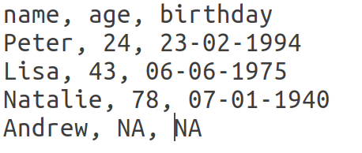
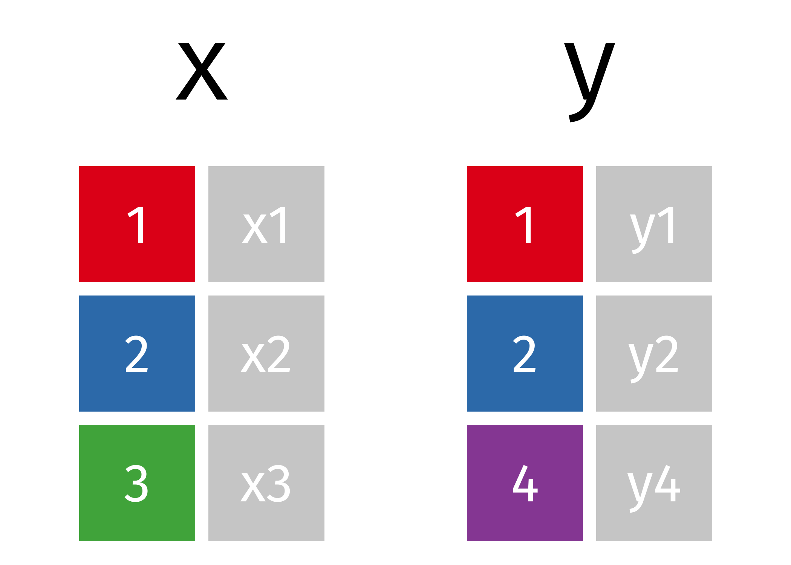

<script src="https://ajax.googleapis.com/ajax/libs/jquery/1.12.2/jquery.min.js"></script>

<script>
    $(document).ready(function() {
    $('slide:not(.title-slide, .backdrop, .segue)').append('<footer></footer>');    
    $('footer').attr('label', 'Slides are available at https://github.com/sflippl/r-lectures');

  })
</script>

<style>
  footer:after {
    font-size: 12pt;
    content: attr(label);
    position: absolute;
    margin-left: auto;
    margin-right: auto;
    left: 0;
    right: 0;
    text-align:center;
    bottom: 20px;
    line-height: 1.9;
    display: block;
  }
</style>

```{r setup, include=FALSE}
knitr::opts_chunk$set(echo = TRUE)
library(tidyverse)
```

## Agenda

> - Data import
> - Principles of R
> - Data tidying
> - Join tables

# Data import

## Sharing data

```{r echo = FALSE}

```

## Sharing data

```{r echo = FALSE}


```

## Exercise 1: Learn how to read in delimited files

1. Read sections 11.1 and 11.2
2. Complete the exercises in 11.2.2 in [r4ds.had.co.nz]

## Parsing files

- `read_csv` takes the first 1000 lines of a table to guess the column type.

```{r}
read_csv("a\na")
```

## Parsing files

- `read_csv` takes the first 1000 lines of a table to guess the column type.

```{r}
read_csv("a\n1")
```

## Parsing files

- `read_csv` takes the first 1000 lines of a table to guess the column type.

```{r}
read_csv("a\n2010-01-01")
```

## Parsing files: problems

Problems occur if:

> - the first 1000 lines are not particularly informative
>       + only NA values
>       + only integers even though non-integers occur later
> - the way in which the values are entered is not entirely clear
>       + dates
>       + factors

## Other formats

> - Binary files
>       + feather implements a binary format to share across languages
>       + RDS is a format specific to R
> - SPSS, SAS, Stata: `haven`
> - Matlab, Excel etc.

# Principles of R

## Make common tasks more accessible

```{r eval = FALSE, echo = TRUE}
df <-
  file %>% 
  read_delim(delim = ",", na = c("", "NA"), 
             skip = 0, ...)
```

becomes ...

```{r eval = FALSE, echo = TRUE}
df <- 
  file %>% 
  read_csv()
```

by:

- special functions
- default values

## Make generalized functions consistent

- `read_delim` has the same interface as `read_csv`, with additional parameters

# Data tidying

## Reminder: Tidy Data

> 1. Each variable forms a column.
> 2. Each observation forms a row. 
> 3. Each type of observational unit forms a table.

## Data Tidying

> - Data often arrives in an untidy state
> - *Data tidying* refers to the procedure by which we make this data tidy
> - Task of the package `tidyr` (part of the tidyverse)
>     + `gather` summarizes column names as a new column
>     + `spread` spreads variable levels as new column names

## `spread` and `gather` 

```{r echo = FALSE, out.height = "400px"}
knitr::include_graphics("5-original-dfs-tidy.png")
```

## `spread` and `gather`

```{r echo = FALSE, out.height = "400px"}
knitr::include_graphics("5-tidyr-spread-gather.gif")
```

## `gather`: example

```{r}
table4a
```

## Exercise 2

Fill in the corresponding lines in the code to tidy the table

```{r eval = FALSE}
table4a %>% 
  gather(
    # Specify the name of the key, i. e. the variable which has the 
    # different columns as values
    key = ,
    # What name should the column have in which the former cell values
    # are notated
    value = ,
    # Specify the columns which are variable levels
    ...)
```

## `spread`: example

```{r}
table2
```

## Exercise 3

Fill in the corresponding lines in the code to tidy the table

```{r eval = FALSE}
table2 %>% 
  spread(
    # the variable which gives the new column names
    key = ,
    # the variable which gives the new column cell values
    value = 
  )
```

# Join tables

## Joining two data frames

> - combine information from two data frames
> - covered by the `*_join` functions in `dplyr`
> - join *by* certain columns

## Joining two data frames

- combine information from two data frames
- covered by the `*_join` functions in `dplyr`
- join *by* certain columns

```{r eval = FALSE}
table1 %>% 
  *_join(table2, by = "column(s)")
```


## Joins: example

```{r}
band_instruments
```

## Joins: example

```{r}
band_members
```

## Left, right, inner, full

> - generate a table with columns from both tables
> - differ in the observations which they keep

## Joining tables: animations

```{r echo = FALSE, out.height = "400px"}

```

## `inner_join`

```{r echo = FALSE, out.height = "400px"}
knitr::include_graphics("5-inner-join.gif")
```

## `left_join`

```{r echo = FALSE, out.height = "400px"}
knitr::include_graphics("5-left-join.gif")
```

## `left_join`

```{r echo = FALSE, out.height = "400px"}
knitr::include_graphics("5-left-join-extra.gif")
```


## `right_join`

```{r echo = FALSE, out.height = "400px"}
knitr::include_graphics("5-right-join.gif")
```

## `full_join`

```{r echo = FALSE, out.height = "400px"}
knitr::include_graphics("5-full-join.gif")
```

## Exercise 4

1. Generate a table with all band members from `band_members` and the instruments which they are playing.
2. Generate a table which gives you information all players where you know in which band they are playing which instrument

## Filtering joins

> - filter `table1`
> - `semi_join` keeps the observation which can be found in `table2`
> - `anti_join` keeps all other observations

## `semi_join`

```{r echo = FALSE, out.height = "400px"}
knitr::include_graphics("5-semi-join.gif")
```

## `anti_join`

```{r echo = FALSE, out.height = "400px"}
knitr::include_graphics("5-anti-join.gif")
```

## Exercise 5

1. Generate a table with all band members whose instruments is not known

## Further reading

- R4DS, ch. 11-13
- [Data transformation cheat sheet](https://www.rstudio.org/links/data_transformation_cheat_sheet)
- [Data import cheat sheet](https://github.com/rstudio/cheatsheets/raw/master/data-import.pdf) (includes `tidyr` functions)
- [Animated explanations of R functions](https://github.com/gadenbuie/tidyexplain)